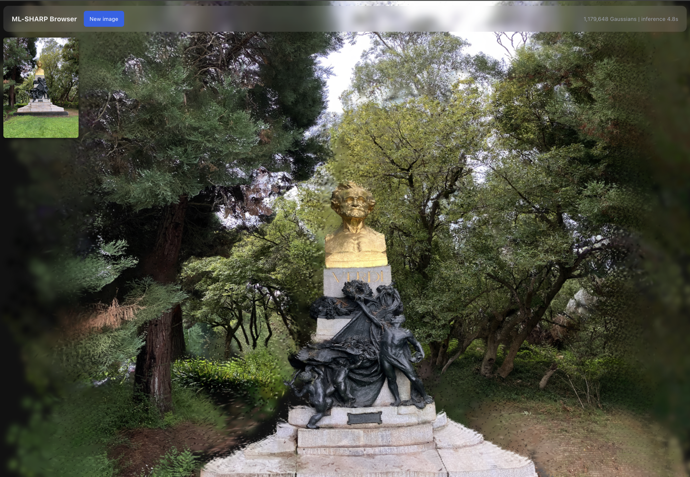

# ML-Sharp Browser

⚠️ Requires Chromium-based browser ([for now](https://caniuse.com/?search=webgpu))

Browser-based inference of [Apple's SHARP](https://github.com/apple/ml-sharp) single-image 3D Gaussian prediction model, running via ONNX. Heavily vibe-coded proof of concept.

The model was exported to ONNX then uploaded to HuggingFace ([link](https://huggingface.co/mxtx0123/ml-sharp-onnx)). It's approximately 2.6gb.

A React app is included which allows a user to convert their own images. It can be [viewed online here](https://miketahani.com/ml-sharp-browser/). Select a photo and the app runs the full SHARP prediction pipeline in your browser. Image is processed by a ViT encoder, decoded into 3D splats, and rendered as an interactive splat scene. No images are uploaded anywhere and inference happens 100% clientside.

